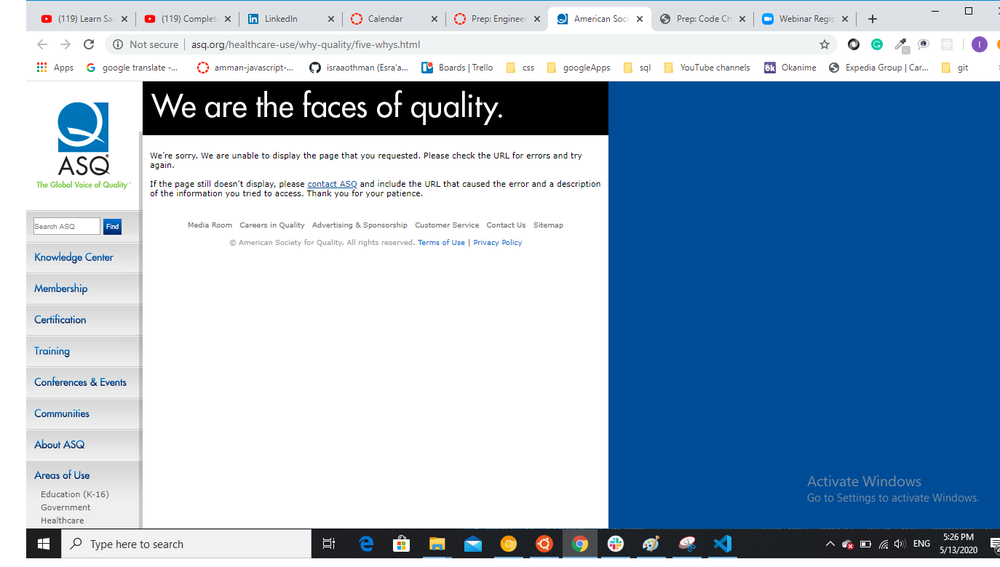

# Engineering Topics   

## Solving Problems  
    Before we start solving any problem we have to read it well and fully understand it to avoid errors during coding   
    also the best practice is to solve the problem manually with 3 sets of sample data then optimize it to a manual steps (you can write the steps as a pseudo-code ) and after that optimize it to a real code 
    
  
  
## Act like you make $1000/hr 
   from this article I figured out that if I placed a high value on my time, a lot of things will change, I will stop saying yes for a lot of things, I will think twice before I spend time for anything 
   Also I liked this qoute : 

   > “The difference between successful people and really successful people is that really successful people say no to almost everything.”  
   > - Warren Buffet   

   
## How to think like a programmer
   The worst way to solve a problem is to start coding and try a solution as a first step, even if it works.
   #### The write steps are ?
   1. Understand the problem  
        try to explain it to make sure that you understane it 
   2. Plan   
        ask your self the right questions to know the right steps you should walkthrough
   3. Divide 
         if the problem is big don't try to solve it this will make it worst, try to divide it to a small problems, this will be much easier 
   4. Now if you stuck on some point, this is normal and you have to   deal with it by following these steps :
       - **Debug**: Go step by step through your solution trying to find where you went wrong.
       - **Reassess**: Take a step back. Look at the problem from another perspective
       - **Research** : GOOGLE 

## The 5 Whys and Hows
   the link for this article unable to display the page 
   
  
 

