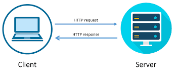

# HTTP and REST

## what is HTTP ?
 - It is stands for Hyper Text Transfer Protocol 
 - It is the set of rules for transferring files (multimedia files) on world wide web  
 - It is the foundation of any data exchange on the Web and it is a client-server protocol  
 - is a stateless request-response application layer protocol  

 ## what is :  
  1. **server** ?  
     computing model a host designed to provide a service  
  2. **clients** ?  
     are hosts that make requests to that service.  
     
_The HTTP specification defines how requests and responses should be formatted, but not what a service should represent_  

  

 ## HTTP request ?
   + http  request is formatted in text and transferred using TCP  
   it contains :
     - at the first line : **method** / **URL** / **HTTP VERSION**  
     - the following lins contain the **request HEADERS**  
     - for example :  
       

 ## What are the HTTP methods ?  
   1. GET --> to retrive data from a specified resource  
   2. POST --> Submit data to be processed to specified resource  
   3. PUT --> update a specified resource  
   4. DELETE --> delete a specified resource  

   - other requests method :  
    + HEAD --> same as get but doesn't return a body  
    + OPTIONS --> return the supported HTTP methods  
    + PATCH --> update partial resources  

     
 ## HTTP response ?  
  + formatted in text and transferred using TCP but it contains : 
    - at the first line **HTTP VERSION** / **STATUS CODE** / **STATUS MESSAGE**  
    - the following lins for the headers  
    - for example :  
      

 ## REST ?
   - It is is acronym for REpresentational State Transfer  
   -  is an architectural style for providing standards between computer systems on the web, making it easier for systems to communicate with each other  
  

    

  #### Swagger :  
    Swagger Docs present developers a way not only to see how to use an API but to actually use it.  
     Yes, this is documentation that allows for live requests from with it.
  
   

  

   

 
    

